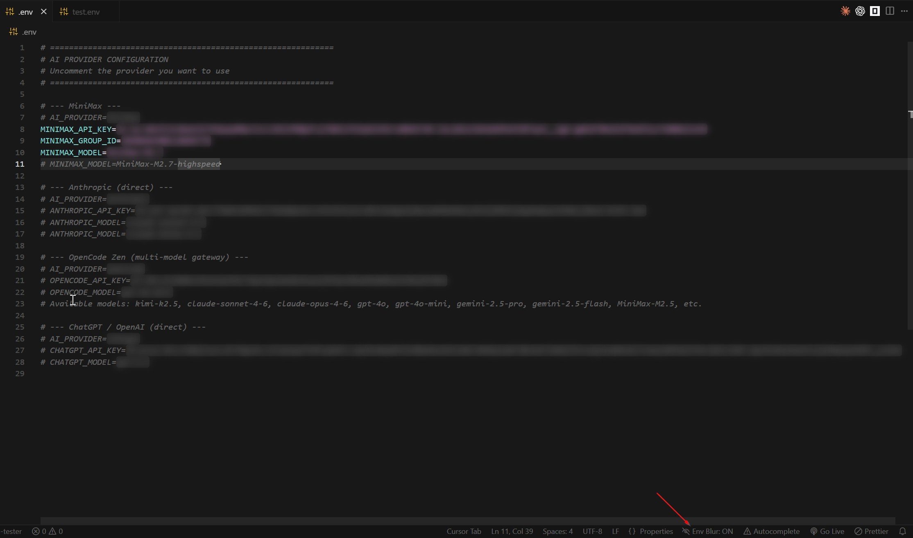

# Env Blur

> Protect your secrets while screen sharing or recording. Blur `.env` values with a frosted-glass effect — click a line to reveal it.



## Features

- **Frosted-glass blur** on all environment variable values — keys stay visible, values are unreadable
- **Click to reveal** — place your cursor on any line to temporarily show its value; move away to re-blur
- **Commented variables too** — lines like `# API_KEY=secret` are also blurred
- **Status bar toggle** — an `Env Blur: ON/OFF` button appears in the bottom bar whenever you open an env file
- **Works on all env file variants:**
  - `.env`, `.env.local`, `.env.production`, `.env.example`, `.env.staging`, etc.
  - `.envrc` (direnv)
  - `env`, `env.example`, `env.development` (without leading dot)
  - `staging.env`, `production.env` (suffix format)

## Usage

1. Open any `.env` file — values are automatically blurred
2. **Click on a line** to reveal its value; click elsewhere to re-blur it
3. Use the **status bar button** (bottom-right) or run `Env Blur: Toggle` from the Command Palette (`Ctrl+Shift+P`) to turn blurring on/off

## Configuration

| Setting | Default | Description |
|---|---|---|
| `env-blur.enabled` | `true` | Enable or disable env value blurring |
| `env-blur.blurColor` | `#808080` | Background color for the blur overlay |

## Installation

### VS Code / Cursor

Search for **"Env Blur"** in the Extensions sidebar, or install from:

- [Visual Studio Marketplace](https://marketplace.visualstudio.com/items?itemName=erevecov.env-blur-protect)
- [Open VSX Registry](https://open-vsx.org/extension/eduardorevecovillalobos/env-blur-protect)

### Manual

```bash
# From VSIX
code --install-extension env-blur-0.1.0.vsix
```

## Why?

Environment files contain API keys, database passwords, and other secrets. During screen sharing, pair programming, or recording tutorials, it's easy to accidentally expose them. **Env Blur** keeps your values hidden with a frosted-glass effect while letting you see the keys — so you always know what's configured without leaking secrets.

## License

[MIT](LICENSE)
